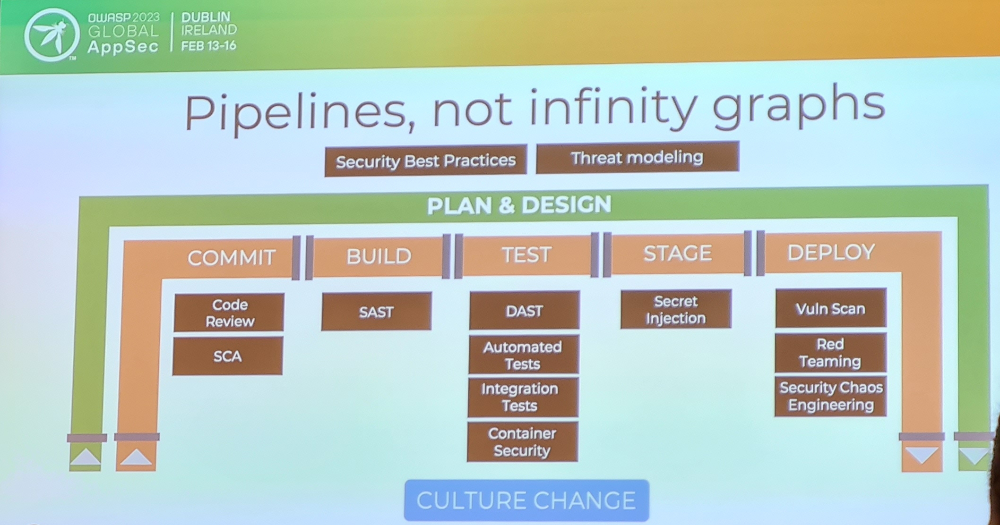

This week I attended [OWASP Global AppSec Dublin 2023](https://dublin.globalappsec.org/) and it was good to be
back at an OWASP event and connect with some familiar faces but also great to see new faces too. I think the overall 
attendance was around the 500, and it was really well run - we were well fed and watered! It was also great to see all 
four keynotes delivered by woman. However, I'm still not sure about the rebrand announcement. I get you got to keep 
the wasp but Open _Worldwide_ Application Security Project doesn't seem quite right...

It's always unfortunate when there's a clash of talks that you're really interested in, but you've got to pick one. The 
morning sessions especially suffered from this and can't wait to see the videos go up to catch what I missed. 

Over the two conference days I attended the following talks 

### Day 1

- A Taste of Privacy Threat Modeling (Kim Wuyts)
- Far from green fields - introducing Threat modelling to established teams (Sarah-Jane Madden)
- Ten DevSecOps Culture Failures (Chris Romeo)
- Why winning the war in cybersecurity means winning more of the everyday battles (Jessica Robinson)
- Bootstrap and increase your software assurance with OWASP SAMM v2.1 (Sebastien Deleersnyder & Bart De Win)
- Server Side Prototype Pollution (Gareth Heyes)

### Day 2 

- Shifting Security Everywhere (Tanya Janca)
- OWASP Serverless Top 10 (Tal Melamed)
- AI-Assisted Coding: The Future of Software Development; between Challenges and Benefits (Dr. Magda Chelly)
- Developer Driven Security in high-growth environments (Jakub Kaluzny)
- Get On With The Program: Threat Modeling In and For Your Organization (Izar Tarandach)

If there was an overall theme I think it'd be _Threat Modelling_ and I was happy to see a lot of talks on the topic as
I'm interested in how different people perform threat modelling, how to scale it and what tools people use. 

Before delving into each talk here a list of interesting / useful tools mentioned within each of the talks (also 
scattered thoughout this post)

- [LINDDUN](https://www.linddun.org/) - what STRIDE is for security, LINDDUN is for privacy threat modelling
- [Adam Shostack's 4 Questions](https://github.com/adamshostack/4QuestionFrame) - the four questions you should be 
asking yourself when you threat model
- [Threat Modeling Manifesto](https://www.threatmodelingmanifesto.org/) - sharing distilled collective knowledge
- [OWASP Threat Dragon](https://owasp.org/www-project-threat-dragon/) - a tool to threat model
- [DevSecOps Architecture Tools](https://github.com/djschleen/devsecops-architecture-tools) - architecture Images for drawing pipeline threat models
- [OWASP DevSecOps Maturity Model](https://owasp.org/www-project-devsecops-maturity-model/)
- [OWASP SAMM](https://owaspsamm.org/)
- [OWASP Top 10 CICD risks](https://owasp.org/www-project-top-10-ci-cd-security-risks/)

### A Taste of Privacy Threat Modeling (Kim Wuyts)

Kim kicked off the conference with the first of many threat modelling talks but this one had a twist where it was about
privacy rather than security and highlighted the use of [LINDDUN](https://www.linddun.org/). I like when people bring
real life threat modelling into their talks and Kim didn't disappoint. She used the analogy of her kid going into an 
ice-cream shop and wanting pretty much everything and settling on a cone with three scoops. As a parent you do a threat 
model and think - the top scoops is going to fall off, the middle scoop the child doesn't even like that flavour, the 
bottom scoop is going to melt and you're going to have to eat it and the child is simply going to take a big bite out 
of the bottom of the cone! Even with this real life example you can utilise the [4 questions](https://github.com/adamshostack/4QuestionFrame) (
modifyied slightly) from Adam Shostack

1. What's going on 
2. What can go wrong 
3. What to do about it 
4. Wait a minute!

Kim made the argument why privacy matters with many examples like those from [Strava](https://www.theguardian.com/world/2018/jan/28/fitness-tracking-app-gives-away-location-of-secret-us-army-bases), 
[Roomba](https://www.technologyreview.com/2022/12/19/1065306/roomba-irobot-robot-vacuums-artificial-intelligence-training-data-privacy/)
and with the restrictions around abortion in the US the ability to figure out if [someone is pregnant](https://www.forbes.com/sites/kashmirhill/2012/02/16/how-target-figured-out-a-teen-girl-was-pregnant-before-her-father-did/).

Like security, privacy threat modelling should be done as early as possible with the following and used an example of a 
doll that was [banned in Germany](https://www.reuters.com/article/us-germany-cyber-dolls-idUSKBN15W20Q) to perform a 
privacy threat model which was fun and showed it all starts with a diagram and thinking about the flow of data. The 
process is (think of the 4 questions)

1. Model the system - create a DFD / whiteboard
2. Elicit Threats - map model components and identify threats
3. Mitigate threats - assess & prioritize then mitigate
4. Reflect - reflect and repeat

Kim argued that privacy and security don't have to be at logger heads but can work together e.g. for security we want
logs and very detailed logs so we can figure out what happened. For privacy we're worried about what we're collecting
from those logs and does it violate privacy. 

Security - protecting data, company assets, (external) attackers
Privacy - protecting personal data, data subject assets, attacker + (internal) misbehaviour

In closing, she said to do threat modelling early ideally the sooner the better, but it's never too late and that the 
outcome of threat modelling should be meaningful where it has actual value to stakeholders. 

### Far from green fields - introducing Threat modelling to established teams (Sarah-Jane Madden)

Sarah-Jane's talk was more focused on the challenges of introducing Threat Modelling to well established software teams
where the organisation comprises of legacy applications, new application as well as acquisitions. She made a great 
opening remark that _Cyber is about hearts and minds as much as its about tech_. She went on to say at the start of her
threat modelling journey she thought simply why can't we just *do* threat modelling!! and idealistically why not shift 
everything so far left we don't have to worry about pentesting etc. As with a lot of things the theory soon gives way to 
reality. She went on to talk about the various mistakes that were made over the course of rolling out threat modelling 
_from the trenches_.

The first being not realising the importance of the why. Doing the right thing for the sake of it because everything 
you've read from the security industry stresses the importance of it but failing to understand what leadership should 
want and why project management should care. Time is precious and at the end of the exercises you're left with a bunch 
of tickets and questions of whether to groom these and do they go into the sprint. 

Having project management on board nothing could go wrong, except the fact the security team let lose a best practice
on a population of about 300 developers without much guidance where developers being developers started to come up with 
solutions and got bogged down with documentation. The security team had to step in and stop the choas! She explained the
model team was not the one who was doing threat modelling for years already (that culture didn't translate acroos the 
org) but actually the team that was busy where they did it little and often and actually produced actionable tickets.
Also teams can get stuck and not know what to do where she found facilitated sessions worked really well.

Covid hit and undid a lot as people went into their bubbles where she said teams were getting no findings not because
they were building the perfect software but just that they needed another facilitated session - not in a finger pointing
you're doing a bad job but just to get them unstuck. She emphasised to let teams use their own tools as some may be
maintaining a monolith while others are building a microservice so there's no one size fits all!

I liked the parallel of Irish dancing and threat modelling - when you're a professional dancer you've practiced
so much you're got muscle memory. The same is true with threat modelling, iterate, iterate, iterate!

When measuring the success she recommends the following indicators

- Reduced security incidents
- Improved documentation
- Better system understanding
- Removing silos

She closed with the following recommendation

- Set scope
- Do a little and often
- Timebox the activity
- Meet developers where they're at
- Keep an eye on team's output for staleness (0 findings etc.)

### Ten DevSecOps Culture Failures (Chris Romeo)

Chris opened with a trip into the future travelling 88 miles per hour and asking will DevOps still be relevant. He
thinks so, the tools will be very different but the DevOps will still be there. He then went referencing the [Gitlab survey for DevOps](https://about.gitlab.com/developer-survey/)
where the top answer for the most challenging part of their role is security highlighting its not that people don't 
want to do a good job with security its just that it's currently pretty difficult. 

Chris poses the question "What is culture within an organisation?" = What happens when people are left to make their own 
decisions. Example promising to push a feature by the end of the week. At the end of the week a security vulnerability
is discovered. Does that developer pushed the code as they're under pressure from management or do they hold off until
next week because of the vulnerability?

Chris argues we don't need to Sec in DevSecOps, that it's just DevOps because security is a part of DevOps already. He 
lists the top 10 failures as

1. The infinity graph

He hates the DevSecOps [infinity graph](https://www.synopsys.com/glossary/what-is-devsecops/_jcr_content/root/synopsyscontainer/column_799096233_cop/colRight/image.coreimg.svg/1620854193880/devsecops.svg)
as he argues that pipelines is a better way. Threat modelling should sit outside the pipeline but that's okay don't force
everything into the pipeline.

2. Security as a special team

Security shouldn't be left to a small number of people. He makes the point that there should be a foundational layer 
not just appsec training for developers but also coding for the security team. You need to understand the challenges
developers face.

3. Vendor defined DevOps

Just because the cloud vendor does it that way you should just consider that their approach and Embrace the reality of 
your devops.

4. Big Company Envy

Etsy, Facebook and Netflix have been doing this for years. It's an incremental progression. You could use the [OWASP 
DevSecOps maturity model](https://owasp.org/www-project-devsecops-maturity-model/) or look at [OWASP SAMM](https://owaspsamm.org/) 
and applied it to DevSecOps and road map where you need to get to in the future.

5. Marketing term infatuation

He dislikes the "Shift left!" - what about everywhere else? All things have to work together. He explains that RASP is 
powerful now and with no false positives. We should be implementing security everywhere and concerning ourselves with it 
everywhere not just left.

6. Overcomplicated pipelines and doing everything now

Start simple, live simply. Start with one or two tools. You won't solve everything immediately.

7. Security as a gatekeeper

We have to enable the business and developers. He recommends using the phrase _Drop the no, try yes, if..._ where the 
se of _if_ instead of _but_ is more effective. Look to culture change, practice empathy and understand what our 
developers have to deal with. How they use your tools. He recommends providing coaches from each discipline (Life coach 
for application security) essentially a person who is between the champion and the security team.

8. Noisy security tools and too many

Tune the tools! Never waste anyone's time. So when adding a new tool add minimal policy - just coz the tool does 29 
different things doesn't mean you turn them on. Take a more static approach. Results of the highest fidelity. Ask for
feedback.

9. Lack of threat modelling

He explains that threat modelling happens outside the pipeline where you should attach threat modelling to new feature.
Teach everyone to threat model and bring threat modelling to where they operate.

10. Vulnerable code in the wild
Look at the [OWASP Top 10 CICD risks](https://owasp.org/www-project-top-10-ci-cd-security-risks/) ad embed SCA in the pipelines

### Why winning the war in cybersecurity means winning more of the everyday battles (Jessica Robinson)

Jessica's overall message was "Great things take time" she looked back at her early life and career and saw the imposter
syndrome and lessons she learned on the way to becoming a CISO. She highlighted the barrier of being told you just don't
get this or these are the basics and if you don't understand them then you need to quit. This is something she's heard
from a lot of woman, and she reckons is one of the reasons we don't have women in tech. She highlighted J.F. Kennedy's
trip to NASA and asked one of the leaders, an engineer and a janitor what they were doing. All three gave the same 
answer - we're going to the moon. She highlighted how important it was that everyone within an org knows what the goal 
is. She then turned this question on the audience and said do we as a security industry know what the goal is. The 
answer is no but she highlighted its something we need to change in ourselves and those changes in ourselves and those
questions and coming together will help use work towards the one goal to win the cybersecurity war.

### Bootstrap and increase your software assurance with OWASP SAMM v2.1 (Sebastien Deleersnyder & Bart De Win)

