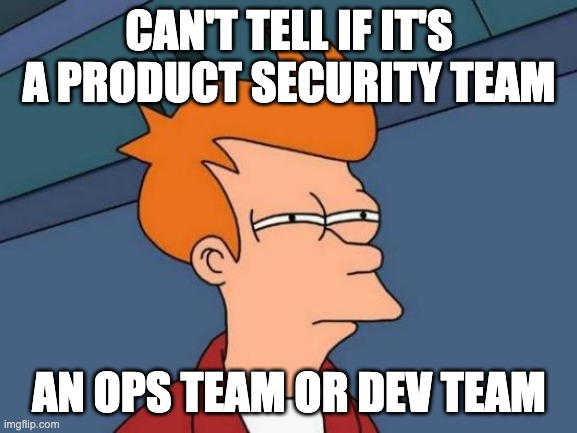
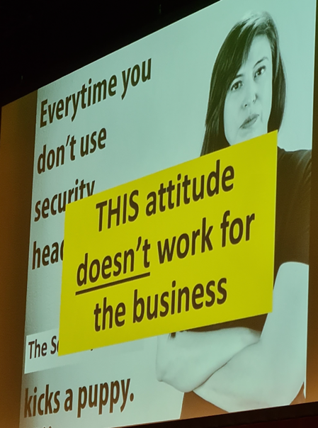

[Previously](2023-02-17-owasp-global-appsec-dublin-day1.md) I said threat modelling was a big theme at the conference,
but I think embracing failure would be another. Lots of presenters shared their failures and how they learned from them
and grew their programs from those lessons learned. This is something I've really got behind recently. Another thought 
I had when people presented especially around solutions was what's the role of the product/application security team?




I've seen a lot of _"we build our own tools"_ which can lead to the product security team becoming a development team
because once you start building things the team owns it and have to maintain them, even enforce the rules they set to
other teams (practice what you preach) like security scans, threat modelling, etc. Also, if the software is integral to the
business then you're on the hook if there are any bugs or your software is slowing down teams or pushing out products. What
about when the one or two people who built the software leave? Is there talent on the team to take over or does the
business hand over the software to a development team?

There are also folks who say _"we run SAST, DAST, SCA, container scanning, we automate threat modelling,
etc. etc."_ this can lead to the product security team becoming an ops team looking after the upkeep and management of
those tools. The day-to-day may get in the way of what others feel the product security team _should_ be doing such as
being an internal pentest team, security research, building custom training based on vulnerabilities found in the
organisation's products, and anything else people find _cool_. There are many opinions on this, and I don't think
I've seen the right answer / the right balance for a product security team. It's something to bear in mind
when building out a program.

Here's a list of resources from day 2 

- [Defect Dojo](https://www.defectdojo.org/) - Application Security Management Tool (all your scans in one place)
- [OWASP Serverless Top 10](https://owasp.org/www-project-serverless-top-10/)
- [OWASP DVSA](https://github.com/OWASP/DVSA) - deliberately vulnerable cloud/serverless application (don't deploy to production!)
- [CodeSec](https://github.com/contrastsecurity/contrast)- will scan serverless functions for vulnerabilities
- [OWASP pytm](https://github.com/izar/pytm) - Pythonic framework for threat modeling
- [Gherkin](https://github.com/cucumber/gherkin) - Gherkin is a plain English text language, which helps the tool - Cucumber to interpret and execute the test scripts.
- [OWASP Cloud Security](https://github.com/owasp-cloud-security/owasp-cloud-security#threat-stories) - Threat stories using Gherkin


### Day 2

- Shifting Security Everywhere (Tanya Janca)
- OWASP Serverless Top 10 (Tal Melamed)
- AI-Assisted Coding: The Future of Software Development; between Challenges and Benefits (Dr Magda Chelly)
- Developer Driven Security in high-growth environments (Jakub Kaluzny)
- Get On With The Program: Threat Modelling In and For Your Organization (Izar Tarandach)

### Shifting Security Everywhere (Tanya Janca)

It was good to hear consistency from all the speakers as Tanya stated she's a fan of starting small when threat
modelling. She also recommends using [Adams four questions](https://github.com/adamshostack/4QuestionFrame) but also
ensuring you have capacity. My key takeaway from Tanya's talk is the security team needs to have good soft skills and be
empathic. She opened with the example of where the security team pushes out a best practice like storing all their
secrets in a secret management tool but when she went to talk to the teams about why they're not following the published 
best practice the development teams explained they weren't allowed to buy one.

There are a couple of tips she had for creating threat models

- It should be a whiteboard and not a document
- Give developers tools, so you enable them to do the threat modelling themselves
- Make friends with the project manager
- Figure out what can go into the pipeline and what can be done overnight
- Ask to get on the project kick-off meetings
- Be friendly!
- Make time to talk with the developers to see what they're doing

She also had some tips for product security in general

- Create a security champions program as these people will help create and maintain your SDLC
- Ensure you have upper management buy-in
- Ensure you Train developers in the tool, don't just roll it out
- Talk to the incident response team and find out what's happening to the application in production
- Ensure your teams know the importance of logging
- Talk to the champions 1 to 1 once a month (I felt this one just wouldn't scale)
- Use something like [Defect Dojo](https://www.defectdojo.org/) to centralise your scans
- Ensure you have an inventory of your apps
- Measure - how is your program going
- Don't stop - it's hard to pick things up again so keep the program going
- Get feedback all the time - ask what concerns them, what they wish security could provide and what is missing
- Review all the policies and assess what causes pain friction issues - offer solutions
- Listen - the more you listen the more you'll find what they need

You can see from this list that soft skills and empathy are key to running a successful program, Tanya's slides were
great, and I encourage you to check out here talk  when it goes up but the one below I really thought was very funny
(also it highlights an attitude that simply doesn't work anymore)



Having regular touch points with people not only helps the program but Tanya said it's also a way to measure the
success by using the following metrics

- How many people attend
- How many people ask questions
- How many times does someone cancel

### OWASP Serverless Top 10 (Tal Melamed)

The reason behind the OWASP Serverless Top 10 is not everything that applies to web vulnerabilities are found in the
cloud. Serverless, as Tal describes in his talk, is something that's not a monolith and not even a microservice but
tiny chunks of code where teams work hyper-agile, code is shipped to prod once a day and everything is
automated. When developing everything is done bottom-up where it's the developers who decide to deploy to prod.

Serverless architecture

- Each resource needs its own security
- Everything is a lambda function that runs code
- There's usually an API gateway in front of the application

The talk focused on AWS but tried to stay as general as possible where the Tal explained the following is true when
writing a serverless application

- You develop in a read-only environment with the exception of `/tmp`
- It's not wired to the Internet
- Data is temporary
- All code resides in the environment
- Keys are available as environment variables

He focused on the following vulnerabilities in the top 10

- Event Injection
- Broken Authentication
- Over Privileged Functions
- Sensitive data exposure
- Logging and Monitoring

#### Event Injection

What is it? - In a serverless environment events can come from anywhere and the impact depends on function permissions
such as

* Rest APIs
* 3rd part apps
* Cloud storage
* Auth services
* Logs and events - my app processes logs
* IoT voice
* Email
* SNS
* Code pipelines

Unlike web applications, there are other injections such as [MQTT](https://mqtt.org/), email, pub/sub
Event protection - put the control within the lambda function

From the attacker's perspective, access is maintained only for a few hours as the environment will be shut down. They
simply have to send another request and get access again.

How to protect against it?

* Input validation shooting for known-good, then allowed list
* Code needs to be self-protecting
* Files that get to the code will have to be authenticated
* Bear in mind that you can't trust that as another function won't reach your function
* Servers that have external access cannot be trusted


#### Broken Authentication

What is it? - As functions are stateless it leaves serverless applications open to broken authentication attacks where
multiple entry points trigger events and usually there's no continuous flow of data. As an example, Tal used the example
of an application that takes the user's input which sends an email to a manager who has to send a reply to trigger the
lambda function. An attacker could bypass the input by sending a malicious email directly to the SES to trigger the same
lambda function and bypass authentication.

How to protect against it?

* Use authentication services
* Access tokens JWT with signed custom data
* Store state in the DB

#### Sensitive Data Exposure

* Always bear in mind data is stored under `/tmp`
* Sensitive data could be stored in environment variables
* Shodan can be used to find IoT and S3 buckets
* Source code is also in the environment


What to do

* Delete `/tmp` after use
* Use KMS (Key Management Service)
* Secure you [bucket](https://docs.aws.amazon.com/AmazonS3/latest/userguide/security-best-practices.html)
* Run the least privilege
* [AWS Macie](https://aws.amazon.com/macie/) can scan the buckets

#### Over Privileged Functions

What is it? - For this vulnerability, Tal gave the example of a function that connects to a database. The database was
configured to perform all `*` actions and to access all `*` resources. He said that 90%
of these functions are misconfigured in this way.

Using the lambda code snippet below with a  database configured like

- Action = `dynamodb:*`
- Resources = `Allour arn:aws:dbrus-east-1:40218120922:table/*`

```python
def lambda_handler(event, context):
    ...
    response = table.put_item(
        Item={}
    ...
)
```

What can be done?

Set lease privileges such as those below

- Action = `dynamodb:PutItem`
- Resources = `Allour arn:aws:dbrus-east-1:40218120922:table/Dvsa-orders-db`

Use [CodeSec](https://github.com/contrastsecurity/contrast) which will scan serverless functions

#### Logging and Monitoring

What is it? Because you don't own the infrastructure there's no easy way of finding out something went wrong

What to do about it?

* You need to know [where](https://docs.aws.amazon.com/lambda/latest/dg/monitoring-cloudwatchlogs.html) to go in AWS
* Create alerts instead of searching for strings in log entries


### AI-Assisted Coding: The Future of Software Development; between Challenges and Benefits (Dr Magda Chelly)

Magda's talk was thought-provoking where in her view the world is not ready for the risk posed by AI. This is not the
terminator type risk but rather AI is demonstrating that it can be manipulative and gave an [example](https://fortune.com/2023/02/17/microsoft-chatgpt-bing-romantic-love/)
where Microsoft's AI told someone they were in love with them and that their wife didn't love them.

She spoke about the emergence of [CoPilot](https://github.com/features/copilot) and [ChatGPT](https://openai.com/blog/chatgpt/)
and spoke about from a legal perspective things are going to get messy fast. If the code is AI generated who
owns the intellectual property? If it is assisted its a grey area but if generated solely by the AI then it belongs to
the creator of the AI. If someone on your team writes code with AI and embeds it in your code. Would you know and how do
you deal with the fallout?

She went into the attractiveness of a business of AI vs a human who is developing software bearing in mind that quality
needs to be a factor and not just speed. I have to say this was uncomfortable. She highlighted the following

- How long it takes to hire the right person 1 month, 3 months, 6 months after a job posting
- Is that person able to fit into the budget and can do their job
- How many features can they develop and how many bugs can they fix
- How long does it take for them to be effective - 1 month / 3 months
- To write 700k lines of code it'd take a person 3 years
- AI can write 1000s of lines of code in minutes
- What a human can do within 34 hours an AI can do within 10 minutes
- Software engineer $10 to $50 per hour which is $1,700 for 34 hours - an AI can do it for $240
- An AI can write the same amount of code for $240

However, there's a big problem with AI and that's quality! It may, and examples have shown it does introduce software
vulnerabilities. Not only security risks but also ethical issues and biases. There are also attacks against the model
itself like messing with the inputs, data poisoning the training data, garbage in garbage out. She highlighted that in Asian 
countries security testing is not as mature as in Europe and now that anyone can write code freelancers who sell their services
to write code can now just use an AI and sell on what the AI wrote. Yes there are regulations in place but places like
Tunisia sells coding services in Europe, will this be AI-generated without Europeans knowing?

She closed out by saying AI was here to stay and it'll transform software development where the real value in her
the opinion is through testing and automation (she takes a shot at the testers here saying it's a boring job and let's leave
that up to the AI to do)


### Developer Driven Security in high-growth environments (Jakub Kaluzny)

Jakub gave a talk which was based on the tech stack used in his company. The idea and solution they built was interesting 
but it would have been great if it were open-sourced, something Jakub alluded to that he would be happy about and wanted. 
The program they build did the following

• Each pull request has an associated threat model
• It takes less than 5 minutes to complete a pull request
• Threat modelling is done by the developers
• Threats and mitigations are stored in a database
• Exact line references for security mechanisms can be queried
• Product Security is directly involved only when requested by the development teams (10% - 20%)

As the program grew they added new things such as

- Training
- Written docs
- Video training for new hires
- Security champions
- Custom risk assessment templates where front-end and back-end engineers will get relevant questions

Performing Threat Modelling

- If the risk is low then teams are free to push to production
- If the risk is medium then threat modelling is by the engineers
- They use [STRIDE](https://en.wikipedia.org/wiki/STRIDE_(security))
- They draw the diagram and mark the zones
- The person is presented with a set of questions like a survey for the PR
- Output threat modelling as code using [Gherkin](https://github.com/cucumber/gherkin) like with [OWASP Cloud Security](https://github.com/owasp-cloud-security/owasp-cloud-security)
- The threat model dictates and is used as an input when they pentest

In closing Jakub recommended 3 things every team should do to grow their program

- Get data and store it
- Data
- Data

### Get On With The Program: Threat Modelling In and For Your Organization (Izar Tarandach)

Izar is the leader of the [OWASP pytm](https://github.com/izar/pytm) project and in this talk, he didn't go into the how
but rather how do you get this to work at scale because with different teams you've got different cultures.

He makes the point that threat modelling is just one more thing we're asking developers to do and when he first
implemented it his team wasn't helping them. They pushed the "Threat model every story" which wasn't received well so
they had to adjust for developers' language.

Scaling up involved the following

* Well-defined goals
* Well-defined responsibilities
* Actions
* Outcomes should be reproducible and tweakable
* Debriefing lessons learned, improvements

The challenges included

* Constantly changing fast-paced environment/product/services
* Developers like new features - they don't like security
* This stuff takes time
* This stuff is hard

Izar made the point that developers are smart people and smart people don't like to be told what to do. Also, managers
want coders to code! These are things you need to keep in mind. You also need to face the fact that your security team
will never be the right size so everything must be automated, as code, no code, etc.

People also need to understand the fact that threat modelling is a conceptual process and in his opinion, the human will
never really be out of the loop. He highlights the need to measure the program and that [OWASP SAMM](https://owaspsamm.org/)
could be used because to learn lessons you need to know how to measure things.

Bad metrics to use (you may need to go back and accept the risk so numbers can be skewed)

- No. of threats identified
- Numbers of threats mitigated

Good metrics to use

- No. of developers trained in security get people to look at their systems with a security mainframe
- % of attack surface systems being threat modelled
- Customer (the development team) satisfaction - if it doesn't bring value then stop you're doing something wrong!

Train everybody on what? The four questions

1. Be able to model the target system
2. Understand, explain, and imagine what could possibly go wrong
3. Decide what to do about it - fix those things in the context of what they're building
4. Recognise how successful the effort was

Tips for the execution part

1. Have to understand what you are threat modelling - you won't have to scope everything
2. Figure out how much of the scope should be done - what % of the total. How much of the attack surface is covered
3. Get the responsible parties to threat model
4. Per your methodology validate the results
5. Get everything in one place - it's not clear what to do with the results
6. Get people to act on the results

Scale

He says this one is going to hurt! You'll notice the difference between teams shows and may not work for all teams

- What do we need to scale - a process
- What's so difficult about a process - how will it scale
- You can only depend on training. The main predictor of scalability in this case. Training you want people to use.


Mitigate

* Don't just store the output in a drawer
* Ask if they've got any value as people will just try to get you off their backs
* Let people know this is happening
* Surface interesting findings that may apply to other areas
* Call for action on areas that the speed that you need
* Don't make things too urgent, make a distinction
* Offer visibility opportunities by attaching people's participation names

Work on medium and long-term road maps

* Automate
* Look to tools
* Reevaluate
* There are no silver bullets
* Some great tools out there that have nothing to do with threat modelling
* Use everyday tools for the boring parts
* Document these things. If you don't document then it didn't happen
* Use them for the next round

Importance of templates

* Uniform - if you force someone to do too much context switching it will tire them
* Easier to correlate and contrast
* Same info same place
* Someone new moves teams they will be able to use the knowledge from their previous role as the threat modelling is uniform across teams

#### Closing

That's it for my time at OWASP Global AppSec Dublin which overall had some really good talks and I encourage people to
check them out when they get posted. If you went and didn't feel motivated to try you hand a threat modelling I don't
think we were at the same conference. I'd also encourage people to go and sign [https://github.com/owasp-change/owasp-change.github.io](https://github.com/owasp-change/owasp-change.github.io)
as I feel this is an important change that needs to happen to keep OWASP relevant (much more than a simple and questionable rebrand).